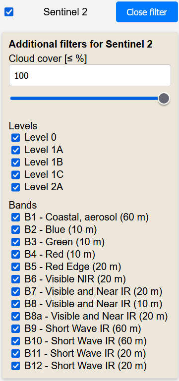

This project aims to develop a system for easy processing and visualizing data obtained from the Sentinel-1 and Sentinel-2 satellite platforms to the end users.

The backend of the system is written in Python and uses the FastAPI framework. It handles downloading, processing, and preparing data for further use or visualization in an asynchronous and modular manner.

The frontend application, programmed in JavaScript, allows users to interactively work with satellite data through a web interface, which includes selecting geographic areas, filtering data by specific parameters, and visualizing the backend's results.

The entire system is designed to be scalable and extensible, allowing for the future integration of additional satellite platforms and functionalities.

Its intuitive GUI provides users with a simple environment for working with satellite data without requiring complex technical knowledge.

## Frontend executive summary

Frontend of the visualization component is programmed in JavaScript, using libraries such as Leaflet or GeoRaster for map plotting and visualization and JavaScript Fetch API to communicate with the backend part of an application. It can be described as a web service that aims to provide end users with Sentinel platform data quickly and easily.

Users can input temporo-spatial parameters, set filters for mission product selection and visualize or download demanded data.

### Key features

- **Spatial filtering:** User can use the interactive Leaflet map to change the area of interest for currently viewed part of world. These coordinates can be inserted manually as well.
- **Temporal filtering:** User can change the time period for filtered data.
- **Selection of dataset and filtering:** Application provides user access to Sentinel's mission data. Currently, Sentinel-1 and Sentinel-2 are supported, but the modular architecture allows an easy way to add more platforms. For each mission, platform-dependent filters can be set (such as levels, polarization, cloud cover, etc.).
- **API data fetching:** Currently, the data is fetched from Copernicus OData API and filtered by provided filter variables. For an area of the Czech Republic, using the Czech national relay is considered an option.
- **Border visualization:** The borders of selected dataset from API reply is visualized on the map using polygons.
- **Image data processing:** Application processes image data on the backend part. Currently, view of image data is possible on the new web browser panel. Further exploration of possible in-map viewing (e.g. tiling, GeoTIFF rendering, etc.) will be done.
- **Backend communication:** Allows for asynchronous processing of visualization requests on the computing server and thus lowers end-user's system requirement.

The entire workflow guides the user from the initial area selection and over time period selection to platform-dependent filtering and then visualization of the requested data. This allows users to work quickly and intuitively with Sentinel mission's data without the need for knowledge of Copernicus API or the complex processing of image data.

### Workflow

1. **Initialization of the map using Leaflet.js:** The map is generated using the Leaflet.js library and filled with standard OpenStreetMap tiles.
2. **Setting the time range:** By default, the range of one week into past is set in the corresponding fields. The user can change this to any desired time period. To eliminate any misunderstandings, time data is always handled in UTC format.
3. **Selecting the area of interest:** The area of interest is defined by a bounding box and its north-west and south-east coordinates. These are automatically filled in at the time of the map initialization. The user can change the coordinates manually by moving the map and pressing the corresponding button or by writing these coordinates into designated fields.
4. **Filtering parameters:** In the current version, products of Sentinel-1 as well as Sentinel-2 missions can be searched. Filters are available for both missions.  
5. **Loading available products:** Data are loaded from the Copernicus OData API. Filtered datasets are inserted into the corresponding `<select>` list. When a product is selected, the area covered by that product is displayed on the map using a polygon. 
6. **Visualizing data:** The data of the selected product can be visualized by pressing the `Visualize selected feature` button. Pressing this button invokes an API call with the ID of selected product to the backend, which begins to process it. 

## Backend executive summary

Backend of the project focuses on downloading and processing of the desired product thus converting it into map-visualizable image data. It is programmed in Python and uses the FastAPI framework with the Uvicorn server to communicate with the frontend. Data is downloaded from the S3 storage using the Boto3 library.

Downloaded data is then processed using the [gjtiff tool](https://github.com/MartinPulec/gjtiff) which relies heavily on CUDA-capable NVidia GPUs utilising [GPUJPEG](https://github.com/CESNET/GPUJPEG) developed by CESNET, [nvTIFF](https://developer.nvidia.com/nvtiff-downloads) and [nvJPEG2000](https://developer.nvidia.com/nvjpeg2000-downloads) libraries. The goal of the gjtiff tool is to convert downloaded product image data no matter how they are formatted into standard 8-bit JPEG image which could be then displayed directly in the web browser. The idea behind gjtiff is that all data processing is undertaken on the GPU and the data should be completely processed in up to 1s on a common gaming GPU.

### Key features

- **Modular design:** The code follows a modular paradigm. This allows for the simple addition of other product types or different methods of storing processed data.
- **Request processing:** API endpoints are exposed to request image visualizations for specific products. These endpoints validate requests and simultaneously store and process them.
- **Data retrieval:** Application connects to the external Copernicus Dataspace storage using the Copernicus OData API to obtain metadata and S3 paths corresponding to the requested products. From there, it queries and downloads the corresponding datasets stored in the Copernicus S3 storage. For the area of the Czech Republic, the possibility of using a Czech national relay is being explored.    
- **Image processing:** Based on the type of product, the downloaded files are filtered and processed for further visualization. The processing is undertaken using the following steps:
  - Decoding: GRD products are decoded using nvTIFF and [nvCOMP](https://developer.nvidia.com/nvcomp-download) for DEFLATE decompress as GRD products are further losslessly compressed. SLC products decoding falls back on CPU using the libTIFF library as SLC product data are formatted as complex integers (which is not supported with nvTIFF). Sentinel 2 products are all stored in the JPEG2000 format where the decoding is straightforwardly done through nvJPEG2000.
  - The image data are then euqalized in the same way as [Sentinel Application Platform (SNAP)](https://earth.esa.int/eogateway/tools/snap) does.
  - The image data could be downscaled based on users input. The idea is that the visualisation component could serve as a quick preview tool so that the users could quickly and visually select datasets for further processing using e.g., SNAP. Scaling is performed using [NVIDIA Performance Primitives (NPP)](https://developer.nvidia.com/npp).
  - The image data is then rotated to follow a natural orientation (i.e., north on top and west and east on right and left respectively). The rotation is implemented using the NVIDIA Performance Primitives again.
  - Resulting image is then compressed into 8-bit JPEG image using the GPUJPEG compression. The compression is limited to a size of 8 GB for the uncompressed image resulting from a previous processing stage. Larger images are further downscaled to fit under this limit. Such a limit is highly practical as the GPU memory is quite scarce resource, GPUJPEG compression is rather memory heavy and we need to limit the whole process to fit completely only into the GPU memory (otherwise the image processing would be slowed down considerably). 

### Workflow

1. **Requesting visualization:** The frontend requests visualization through the endpoint `/api/request_visualization`. Each request is processed asynchronously in the background using the functionality of the `BackgroundTask` framework of FastAPI.
2. **Downloading data:** The request is validated, then the Copernicus Dataspace API is called, and the path to the Copernicus S3 storage is obtained. From there, the data is downloaded into a temporary folder in the backend server's storage.
3. **Processing data:** The data is then processed using the gjtiff tool. Resulting JPEG image is saved on the backend server and URI pointing to the processed image is returned to the fronted and further served to the user.
